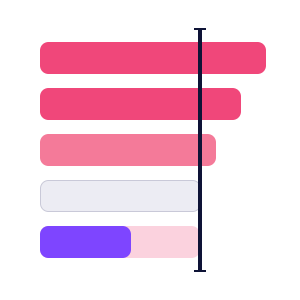

<p align="center">
  
</p>

# Benchmark Bar Chart

A horizontal-bar Power BI custom visual that compares **two measures per item** (e.g. _budget vs actual_, _target vs realized_, _baseline vs current_) and surfaces the items with the largest variances — instantly.

[](./CHANGELOG.md)
[](./LICENSE)
[](https://learn.microsoft.com/power-bi/developer/visuals/)
[](./stringResources)

---

## Why this visual

Native Power BI bar charts can show two measures side-by-side, but they don't tell you _where the action is_. Benchmark Bar Chart was built to answer one question on every dashboard:

> _"Which items are the most off-target — and how off are they?"_

It does this with a 5-zone variance color scale, four sort modes (top / flop / all / Pareto 20-80), a live search, paginated views, a side panel summarising the scope, and a fully-translated UI.

---

## Features

### Analysis
- **Five variance zones** — deep-under, soft-under, on-target (tolerance band), soft-over, deep-over. Thresholds and tolerance are user-configurable.
- **Four sort modes** — Top under-target, Top over-target (flop), All ranked, Pareto 20-80 (auto-paginated when items exceed page size).
- **Two metrics** — absolute gap or percentage gap (toggle from a pill inside the chart).
- **Live search** with optional auto-switch to "All" and substring matching across category names.
- **Side panel** with the scope total, global gap, distribution band, and the most-over / most-under items.
- **Distribution band** (mini horizontal bar) showing the share of items per zone, with optional axis labels.

### Format pane (100+ properties, organised into collapsible groups)
- **Title** — Content · Typography
- **Bar value labels** — Typography · Behavior · Per-zone colors
- **Items axis** — overflow modes (ellipsis · wrap · auto-shrink)
- **Bars** — radius, opacity, drop shadow, height mode (auto/fixed)
- **Zone colors** — five-step palette
- **Decomposition** — soft / deep thresholds, tolerance policy
- **Semantics** — over-is-bad/good direction, custom singular/plural terms
- **Tooltip** — colors, font, radius, label overrides
- **Side panel** — General · Total · Distribution · Global gap · Max over · Max under
- **Controls** — General (sizing/font) · Neutral · Hover · Selected
- **Search** — show, placeholder, auto-switch
- **Sort defaults** — default mode/metric/N, mode label overrides
- **Pagination** — page size + General · Neutral · Hover · Selected pager states
- **Shine effect** — animated bar highlight on enter
- **Number format** — decimals (abs / pct), scaling unit (K/M/B), thousands separator, abs/pct separator
- **Animations** — toggle, duration, easing (in-out · out · linear · bounce · elastic)
- **General** — runtime locale override (auto + 7 languages)

### Microsoft AppSource certification
- `host.eventService` rendering events (started / finished / failed)
- `host.tooltipService` for accessible Power BI tooltips
- `host.colorPalette.isHighContrast` with full high-contrast palette support
- `host.hostCapabilities.allowInteractions` respected
- `selectionManager.select` + cross-visual highlighting + multi-visual selection
- `supportsHighlight`, `supportsKeyboardFocus`, `supportsLandingPage`, `supportsSynchronizingFilterState`
- ARIA labels on every interactive control
- Landing page when the chart has no data
- 0 build warnings, 0 console errors

### Localization
Seven languages out of the box: **English · Français · Español · Deutsch · Italiano · Português (BR) · 中文 (简体)**. The visual auto-detects the host locale; a "Visual language" override in the format pane lets users force any of the supported locales independent of their Power BI session.

---

## Install

### Pre-built package
1. Download the latest `.pbiviz` from the [Releases](https://github.com/iLoveMyData/benchmark-bar-chart/releases) page.
2. In Power BI Desktop or Service: **Visualizations pane → … → Import a visual from a file** → pick the `.pbiviz`.
3. Drop it onto your report and bind 3 fields (Category · Reference · Actual).

### From source
```bash
git clone https://github.com/iLoveMyData/benchmark-bar-chart.git
cd benchmark-bar-chart
npm install
npm run package        # -> dist/*.pbiviz
```
Requires Node.js 18+, [`pbiviz`](https://learn.microsoft.com/power-bi/developer/visuals/visual-tools-installation) certificate setup.

---

## Data roles

| Role | Type | Required | Description |
|------|------|----------|-------------|
| **Category** | Grouping | yes | One row per item (e.g. project, store, account) |
| **Reference** | Measure | yes | The benchmark value (target, budget, baseline) |
| **Actual** | Measure | yes | The realized value to compare against the reference |

The visual computes `gap = actual − reference` and `gap% = gap / reference` per row, then classifies each item into one of the five variance zones.

## Demo dataset

A ready-to-use 100-row enterprise portfolio is provided in [`examples/projects-demo.csv`](./examples/projects-demo.csv) — see [`examples/README.md`](./examples/README.md) for column descriptions and binding instructions.

---

## Roadmap

- AppSource public listing (in progress)
- Drill-through native binding
- CSV export of the filtered list
- Period-comparison mode (reference = N-1)
- Configurable legend for the 5 variance zones

See open issues for the live backlog.

---

## License

[MIT](./LICENSE) © Sammy KARAR

## Privacy & Support

- [Privacy Policy](./PRIVACY.md)
- [Support](./SUPPORT.md) — file an issue on GitHub for bugs and feature requests.
